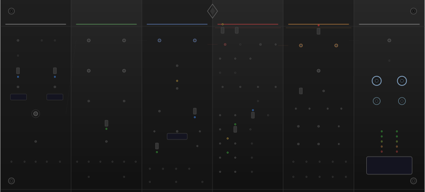

# CurveAndDrag



A stereo pitch-shifting delay module for VCV Rack with shimmer architecture, FFT spectral processing, comprehensive tape emulation, and deep microtonal support.

---

## Table of Contents

- [Architecture](#architecture)
- [Signal Flow](#signal-flow)
- [Pitch Algorithms](#pitch-algorithms)
- [Shimmer and Feedback Processing](#shimmer-and-feedback-processing)
- [Tape Emulation Engine](#tape-emulation-engine)
- [Per-Head DSP](#per-head-dsp)
- [Tuning and Scales](#tuning-and-scales)
- [Parameters](#parameters)
- [CV Inputs](#cv-inputs)
- [Outputs](#outputs)
- [Right-Click Menu](#right-click-menu)
- [Installation](#installation)
- [Usage Tips](#usage-tips)
- [Known Limitations](#known-limitations)
- [Version History](#version-history)
- [Credits](#credits)

---

## Architecture

CurveAndDrag is a 56HP stereo delay built around a switchable pitch placement architecture. The core idea: pitch shifting can happen **before** the delay (classic mode) or **inside** the feedback loop (shimmer mode). This single toggle fundamentally changes the character of the module.

The panel is organised into six sections, left to right:

1. **Input + Sync** -- Gain, audio inputs, tempo sync, main pitch, character, V/Oct
2. **Delay Engine** -- Time, feedback, mix, cross-feedback, head select
3. **Pitch System** -- Detune L/R, drift, morph, algorithm, quantization, scales
4. **Shimmer + Feedback** -- Pitch placement, shimmer controls, feedback EQ/drive/compression, ducking, freeze, frequency shift, reverse grain, bloom, pitch envelope
5. **Tape DSP** -- Saturation, aging, instability, noise, head bump EQ, wow/flutter
6. **Output** -- Gain, main/wet outputs, level meters, tuning display

---

## Signal Flow

### Pre-Loop Mode (Classic)

```
Input --> Input Gain --> Pitch Shift --> DC Block --> Delay Line (internal feedback)
  --> Reverse Grain (optional) --> Bloom/Chorus (optional)
  --> Cross-Feedback --> Tape Processing --> Dry/Wet Mix --> Soft Clip --> Output
```

Pitch shifting colours the input before it enters the delay. Each repeat decays naturally without further pitch alteration. Reverse grain and bloom are applied to the delay output, colouring each echo before output mixing.

### Shimmer Mode (In-Loop)

```
Input --> Input Gain --> [Base Pitch on input] --> DC Block
  --> Delay Line (separated read/write):
      Read delayed signal -->
      Pitch Shift (shimmer step, compounds per iteration) -->
      Reverse Grain (optional) -->
      Bloom/Chorus (optional) -->
      Feedback Processor:
        Frequency Shift --> LP Filter --> HP Filter --> Tilt EQ -->
        Saturation --> Compression --> Ducking
      --> Write back (feedback * processed)
  --> Cross-Feedback --> Tape Processing --> Dry/Wet Mix --> Soft Clip --> Output
```

Pitch shifting happens inside the feedback loop. Each repetition is pitch-shifted again, creating cascading shimmer that rises (or falls) with every echo. The shimmer pitch step can be quantised to the active scale for microtonal shimmer.

---

## Pitch Algorithms

Five algorithms are available, selectable via the Pitch Mode knob. The Morph knob crossfades between the current algorithm and the next in the ring (Lo-Fi -> H910 -> Varispeed -> Hybrid -> Spectral -> Lo-Fi).

### Lo-Fi (Vintage BBD)

Emulates analog BBD delay chips (MN3007/SAD1024).

- Input bandwidth limited via one-pole LP filter (coefficient 0.15 + character * 0.05)
- NE570/SA571 compander modelling: compress before buffer, expand after (controlled by Character knob)
- Charge transfer loss: `0.998 * current + 0.002 * previous` per sample
- 8192-sample circular buffer with cubic Hermite interpolation
- Clock feedthrough artifact: sinusoidal at `sampleRate * ratio * 0.5` Hz, amplitude `0.002 * character`
- White noise injection when Character > 0.5: amplitude `(character - 0.5) * 2 * 0.0001`

The Character knob at higher values produces the characteristic pumping, breathing, and noise floor of aged vintage hardware.

### H910 (Eventide Harmonizer)

Modelled after the original Eventide H910 dual-tap granular harmoniser.

- Two read taps offset by half a grain length for continuous output
- Triangle crossfade window (not Hann -- matching the H910's linear splicing)
- Per-channel clock drift via slow sinusoidal modulation of grain size
- Grain size: `512 * drift / abs(ratio)`, clamped to 128-2048 samples
- 4096-sample buffer with cubic Hermite interpolation
- Each grain reads at the pitch `ratio` speed

The triangle crossfade produces the distinctive glitchy splice artifacts of the original hardware.

### Varispeed (Tape Speed)

Pure variable-speed playback, simulating a tape machine with speed control.

- Read position advances at `ratio` rate through a 16384-sample buffer
- Cubic Hermite interpolation for smooth, tape-like quality
- No windowing or granular processing -- the simplest and most transparent algorithm
- Produces natural Doppler-style pitch shift identical to changing physical tape speed

### Hybrid (Laroche-Dolson Phase-Locked)

A 4-grain phase-locked pitch shifter using the Laroche-Dolson identity phase locking method. High quality with minimal artefacts.

- 4 overlapping grains staggered at 25% intervals
- Adaptive grain size based on pitch deviation: 2048 samples (<10% shift), 1024 (<50%), 512 (>50%)
- Hann window per grain: `0.5 * (1 - cos(2*pi*pos))`
- 16384-sample circular buffer with cubic Hermite interpolation
- Output normalised by window sum for unity gain
- Character-dependent saturation blended in for large shifts (>200 cents)

### Spectral (FFT Phase Vocoder)

The highest quality algorithm. An FFT-based phase vocoder with peak-picking and formant preservation.

- 4096-point Cooley-Tukey radix-2 FFT (no external dependencies)
- 75% overlap (hop size = FFT_SIZE / 4) with Hann analysis/synthesis windows
- WOLA (Weighted Overlap-Add) framework for artefact-free reconstruction
- **Peak-picking pitch shift** (Laroche-Dolson 1999): identifies spectral peaks and shifts entire peak regions, maintaining harmonic relationships and eliminating the "phasiness" of naive bin-shifting
- **Formant preservation** via real cepstrum: computes spectral envelope using log magnitude → IFFT → cepstral liftering (cutoff at 30 coefficients) → FFT. After pitch shift, divides by shifted envelope and multiplies by original — eliminates chipmunk/monster voice artefacts
- **Independent time stretching**: synthesis hop can differ from analysis hop, allowing pitch and time to be controlled independently. Time stretch ratio of 2.0 = half speed without pitch change
- Character knob controls formant preservation amount (0 = robotic/vocoder, 1 = full natural preservation)
- Latency: 4096 samples (~93 ms at 44.1 kHz)

This is the only algorithm that supports time stretching. The Time Stretch parameter has no effect in other modes.

### Character / Vintage Post-Processing

Applied after all algorithms based on the Character knob position:

| Range | Name | Effect |
|-------|------|--------|
| 0.0 - 0.33 | Warmth | tanh saturation + even harmonics (0.1 * x^2) |
| 0.33 - 0.66 | Grit | Pure tanh soft saturation |
| 0.66 - 1.0 | Aggression | Sinusoidal waveshaping: sin(x * drive * pi/2) |

All algorithms share a common anti-alias biquad lowpass filter that engages automatically when pitching up (ratio > 1.01), set at `sampleRate / (2 * maxRatio)`.

---

## Shimmer and Feedback Processing

When Pitch Placement is set to In-Loop, the feedback path becomes a rich processing chain.

### Shimmer Controls

| Control | Range | Default | Description |
|---------|-------|---------|-------------|
| Shimmer Pitch | -24 to +24 st | +12 st | Pitch step per feedback iteration |
| Shimmer Mix | 0-100% | 100% | Blend of pitched vs unpitched signal in feedback |
| Direction | Up / Down / Alternate | Up | Pitch step direction |
| Shimmer Quantize | On/Off | Off | Quantise shimmer pitch to active scale |

### Feedback Processing Chain (in order)

1. **Frequency Shift** (Ghost mode) -- Hilbert transform single-sideband modulation. Range: +/-50 Hz. Uses a 4-stage allpass cascade with fixed coefficients tuned for 20 Hz - 20 kHz. Produces inharmonic, metallic textures.

2. **Low-Pass Filter** -- Trapezoidal integrated SVF (Cytomic/Andrew Simper design). Range: 200 Hz - 20 kHz, default 8 kHz. Darkens successive repeats.

3. **High-Pass Filter** -- Same SVF topology. Range: 20 Hz - 2 kHz, default 80 Hz. Thins successive repeats.

4. **Tilt EQ** -- LP/HP blend around a 1 kHz crossover (Q = 0.3). Range: -1 (dark) to +1 (bright), default 0 (neutral).

5. **Saturation** -- `tanh(x * drive) / drive` where `drive = 1 + amount * 4`. Prevents feedback from growing while adding harmonic warmth.

6. **Compression** -- Envelope-following limiter. 1 ms attack, 50 ms release. Threshold = `1 - compAmount * 0.5`. Evens out feedback dynamics with makeup gain.

7. **Ducking** -- Input-level-dependent gain reduction. 5 ms attack, configurable release (10 ms - 1 s). At full duck, the feedback signal drops proportional to input level, allowing the dry signal to cut through.

### Pitch Drift

Per-iteration random pitch drift applied inside the feedback loop. A random walk at configurable rate (0.1-5 Hz) with smoothed interpolation (coefficient 0.001). Range: 0-50 cents. Creates evolving, organic shimmer that never sounds static.

### Reverse-Granular (Crystallizer)

Single reverse-reading grain with Hann window envelope. Grain size: 20-500 ms. Writes input to a 16384-sample circular buffer and reads backwards from the grain start. Mix control blends between forward and reversed signal.

Works in both pre-loop and shimmer modes.

### Bloom (Modulated-Delay Chorus)

True modulated-delay chorus that produces genuine Doppler-effect pitch detuning.

- 8192-sample circular buffer per channel
- Dual LFO: primary sine + secondary at golden ratio offset (phase * 1.618) for richness
- R channel LFO rate is 1.13x the L channel rate for stereo spread
- Centre delay: 3 ms, sweep depth: +/-1.5 ms at full amount
- Combined modulation: `lfo1 * 0.7 + lfo2 * 0.3`
- Catmull-Rom cubic interpolation for artefact-free modulation
- Output: `input * (1 - amount*0.5) + detuned * (amount*0.5)`

In shimmer mode, the chorus detuning does not compound (the LFO always sweeps the same depth), while the shimmer pitch does compound -- so early repeats get subtle chorus, late repeats get cascading shimmer.

Works in both pre-loop and shimmer modes.

### Freeze / Infinite Hold

When freeze is active:
- Feedback is set to unity (1.0)
- New input is crossfaded out over 10 ms (smooth transition)
- Pitch shifting in feedback is disabled
- The delay buffer content loops indefinitely

Freeze can be toggled via the panel switch or triggered via the Freeze CV gate input (>1V = active).

### Pitch Envelope Follower

Tracks input amplitude with configurable attack/release and modulates pitch by up to +/-1 octave (1200 cents). Bipolar: positive amount = louder input means higher pitch, negative = louder input means lower pitch.

### Independent L/R Pitch Offsets

Separate pitch offset knobs for left and right channels, +/-12 semitones each. Added on top of the main pitch and shimmer pitch. Allows stereo harmony intervals.

### V/Oct Input

Standard 1V/Oct pitch control input. 1V = 1 octave = 1200 cents. Added to the main pitch CV for MIDI-driven pitch intervals.

---

## Tape Emulation Engine

A comprehensive tape delay emulation with the following processing chain:

1. **Pre-emphasis EQ** -- High shelf boost (+6 dB at 2 kHz) before recording to tape
2. **Wow and Flutter** -- Combined speed modulation applied to delay read position
3. **Tape Saturation** -- Frequency-dependent saturation with hysteresis
4. **Multi-Head Delay** -- 1-4 configurable playback heads with per-head DSP
5. **Head Bump EQ** -- Peak filter at configurable frequency (60-250 Hz)
6. **HF Rolloff** -- Low-pass filter (3-15 kHz) with configurable resonance
7. **Aging Effects** -- HF loss, compression, random dropouts
8. **Instability** -- Level modulation, speed variation, random dropouts
9. **Tape Noise** -- Pink hiss + 60 Hz hum + random HF artifacts + LF rumble
10. **De-emphasis EQ** -- Inverse of pre-emphasis (-6 dB shelf)
11. **Stereo Decorrelation** -- Channel-offset phase modulation
12. **DC Blocking** -- 2nd-order (Julius O. Smith design, R=0.995)
13. **Soft Limiting** -- `tanh(x * 0.8) / 0.8`

### Wow and Flutter

Three waveform options for each: Sine, Triangle, Random (walk).

Both include a 1/f (pink) noise component via a 3-octave Voss-McCartney algorithm for realism, plus a slow random walk for capstan irregularity. Combined modulation is clamped to 0.8-1.2 (max 20% speed variation).

| Parameter | Range | Default |
|-----------|-------|---------|
| Wow Rate | 0.1 - 5.0 Hz | 0.3 Hz |
| Wow Depth | 0 - 100% | 20% |
| Flutter Rate | 1.0 - 10.0 Hz | 2.7 Hz |
| Flutter Depth | 0 - 100% | 10% |

### Tape Saturation

Frequency-dependent: signal is split at ~500 Hz. Lows receive 1.3x drive, highs 0.7x. Hysteresis modelling blends 15% of the previous output state (magnetic remnance). Drive: `1 + saturationAmount * 5`.

### Head Configurations

| Config | Heads | Delay Times | Character |
|--------|-------|-------------|-----------|
| Single | 1 | 120 ms | Clean, focused. Subtle high-pass character. |
| Dual | 2 | 100 + 170 ms | Stereo panned (L emphasises head 1, R head 2). Chorus between heads. |
| Triple | 3 | 80 + 140 + 200 ms | Weighted mix (0.5/0.3/0.2). Harmonic interaction between heads. Mid-frequency emphasis. |
| Quad | 4 | 70 + 120 + 180 + 250 ms | Progressive mix (0.4/0.25/0.2/0.15). Inter-head modulation. Multi-band EQ + subtle saturation. |

### Aging

Exponential HF loss (aging^2 scaling), periodic modulation, random dropouts (probability aging * 0.0005 when aging > 0.3). Wet amount: `aging * 0.8`.

### Instability

Squared response curve for subtle behaviour at low values. Sinusoidal level modulation, random dropouts, speed variation.

### Tape Noise

Pink noise via 7-stage Voss-McCartney filter, scaled at `noiseAmount^2 * 0.08` (max 8% of signal). Includes 60 Hz hum at 10% of main noise level, rare HF artifacts (~1/second), and 1.7 Hz LF rumble. Hard limited to +/-1% of signal.

---

## Per-Head DSP

Each of the 4 tape playback heads has independent DSP processing, configured via the right-click context menu.

| Parameter | Range | Default | Description |
|-----------|-------|---------|-------------|
| Pitch | -24 to +24 semitones | 0 st | Per-head pitch shift (varispeed through 4096-sample buffer) |
| Filter Mode | OFF / LP / HP / BP / Notch | OFF | SVF filter type |
| Filter Cutoff | 20 - 20,000 Hz | 8000 Hz | Filter cutoff frequency |
| Level | 0.0 - 1.0 | 1.0 | Head output level |
| Pan | 0.0 (L) - 1.0 (R) | 0.5 (C) | Per-head stereo position (equal-power pan law) |

Per-head parameters are saved/loaded with patches (JSON serialisation) but are not exposed as module parameters -- they are accessed exclusively through the context menu.

---

## Tuning and Scales

### Priority Order

1. **MTS-ESP** -- If enabled and a host is connected (checked every 1024 samples)
2. **Scala file** -- If a .scl file has been loaded via the right-click menu
3. **Built-in scale** -- Selected by the Scale Select knob

### MTS-ESP Support

Dynamic library loading at runtime (dlopen/LoadLibrary). Thread-safe with mutex + atomic connection state. Supports note filtering (`MTS_ShouldFilterNote`). Graceful fallback to 12-TET if the library is not available.

### Scala File Support

Standard .scl format parser. Supports both ratio notation (e.g. `3/2`) and cents notation (e.g. `701.955`). Octave (1200 cents) is appended automatically. Quantisation wraps input into the octave and finds the closest scale degree.

### 11 Built-In Scales

| Index | Scale | Description |
|-------|-------|-------------|
| 0 | 12-TET | Standard equal temperament (100 cent steps) |
| 1 | 24-TET | Quarter-tone equal temperament (50 cent steps) |
| 2 | 31-EDO | 31 equal divisions of the octave |
| 3 | Just Intonation | Pure ratios: 1/1, 16/15, 9/8, 6/5, 5/4, 4/3, 45/32, 3/2, 8/5, 5/3, 9/5, 15/8 |
| 4 | Pythagorean | Fifths-based: 1/1, 256/243, 9/8, 32/27, 81/64, 4/3, 729/512, 3/2, 128/81, 27/16, 16/9, 243/128 |
| 5 | Quarter-Comma Meantone | Cents: 0, 76, 193, 310, 386, 503, 579, 697, 773, 890, 1007, 1083 |
| 6 | Well-Tempered | Cents: 0, 90.2, 192.2, 294.1, 390.2, 498, 588.3, 696.1, 792.2, 888.3, 996.1, 1092.2 |
| 7 | 19-TET | 19 equal divisions |
| 8 | 22-TET | 22 equal divisions |
| 9 | 53-TET | 53 equal divisions (closely approximates Just Intonation) |
| 10 | 72-TET | 72 equal divisions (sixth-tones) |

---

## Parameters

### Core Delay

| Parameter | Type | Range | Default | Description |
|-----------|------|-------|---------|-------------|
| Time L | Knob | 0 - 2000 ms | 200 ms | Left delay time |
| Time R | Knob | 0 - 2000 ms | 200 ms | Right delay time |
| Feedback L | Knob | 0 - 110% | 30% | Left feedback (>100% for self-oscillation) |
| Feedback R | Knob | 0 - 110% | 30% | Right feedback |
| Mix L | Knob | 0 - 100% | 50% | Left dry/wet |
| Mix R | Knob | 0 - 100% | 50% | Right dry/wet |
| Cross-Feedback | Toggle | 0 - 100% | 0% | Cross-channel feedback (internally scaled to max 30%) |
| Head Select | Knob | 1 - 4 | 1 | Number of active tape heads |

### Tempo Sync

| Parameter | Type | Range | Default | Description |
|-----------|------|-------|---------|-------------|
| Sync L | Toggle | On/Off | Off | Left tempo sync |
| Sync R | Toggle | On/Off | Off | Right tempo sync |
| Subdiv L | Selector | 6 values | 1/4 | Left subdivision: 1/1, 1/2, 1/4, 1/8, 1/8T, 1/16 |
| Subdiv R | Selector | 6 values | 1/4 | Right subdivision |

### Pitch

| Parameter | Type | Range | Default | Description |
|-----------|------|-------|---------|-------------|
| Pitch | Knob | -2 to +2 octaves | 0 | Base pitch shift |
| Detune L | Knob | -50 to +50 cents | 0 | Left detune (post-quantisation) |
| Detune R | Knob | -50 to +50 cents | 0 | Right detune |
| Detune Drift | Knob | 0 - 25 cents | 0 | Stereo drift LFO depth |
| Pitch Mode | Selector | 0-4 | 1 (H910) | Lo-Fi / H910 / Varispeed / Hybrid / Spectral |
| Time Stretch | Knob | 0.5 - 2.0x | 1.0x | Time stretch ratio (Spectral mode only) |
| Character | Knob | 0 - 100% | 50% | Vintage modelling amount |
| Morph | Knob | 0 - 100% | 0% | Crossfade to next algorithm |
| Quantize | Toggle | On/Off | Off | Enable pitch quantisation |
| Scale Select | Selector | 0-10 | 0 (12-TET) | Built-in scale |
| MTS-ESP | Toggle | On/Off | Off | External tuning source |
| Pitch L | Knob | -12 to +12 st | 0 | Left-only pitch offset |
| Pitch R | Knob | -12 to +12 st | 0 | Right-only pitch offset |

### Shimmer + Feedback

| Parameter | Type | Range | Default | Description |
|-----------|------|-------|---------|-------------|
| Pitch Placement | Toggle | Pre-Loop / In-Loop | Pre-Loop | Pitch position in signal chain |
| Shimmer Pitch | Knob | -24 to +24 st | +12 st | In-loop pitch step |
| Shimmer Mix | Knob | 0 - 100% | 100% | Pitched/unpitched blend in feedback |
| Pitch Direction | Selector | Up/Down/Alternate | Up | Shimmer direction |
| Shimmer Quantize | Toggle | On/Off | Off | Quantise shimmer to scale |
| FB LP Freq | Knob | 200 Hz - 20 kHz | 8 kHz | Feedback low-pass |
| FB HP Freq | Knob | 20 Hz - 2 kHz | 80 Hz | Feedback high-pass |
| FB Tilt | Knob | -1 to +1 | 0 | Tilt EQ (dark/bright) |
| FB Drive | Knob | 0 - 100% | 0% | Feedback saturation |
| FB Comp | Knob | 0 - 100% | 0% | Feedback compression |
| Duck Amount | Knob | 0 - 100% | 0% | Input-dependent feedback ducking |
| Duck Release | Knob | 10 ms - 1 s | 100 ms | Duck release time |
| Pitch Drift | Knob | 0 - 50 cents | 0 | Per-iteration drift |
| Drift Rate | Knob | 0.1 - 5 Hz | 0.5 Hz | Drift speed |
| Freeze | Toggle | On/Off | Off | Infinite hold |
| Freq Shift | Knob | -50 to +50 Hz | 0 Hz | Frequency shift amount |
| Freq Shift Mode | Toggle | On/Off | Off | Enable frequency shifting |
| Reverse Grain | Knob | 0 - 100% | 0% | Reverse grain mix |
| Reverse Grain Size | Knob | 20 - 500 ms | 100 ms | Grain size |
| Bloom Amount | Knob | 0 - 100% | 0% | Chorus depth |
| Bloom Rate | Knob | 0.1 - 5 Hz | 0.5 Hz | Chorus LFO rate |
| Pitch Env Amount | Knob | -100% to +100% | 0% | Envelope-to-pitch modulation |
| Pitch Env Speed | Knob | 0 - 100% | 50% | Envelope follower speed |

### Tape DSP

| Parameter | Type | Range | Default | Description |
|-----------|------|-------|---------|-------------|
| Tape Mode | Toggle | On/Off | Off | Enable tape processing |
| Saturation | Knob | 0 - 100% | 30% | Tape saturation |
| Aging | Knob | 0 - 100% | 0% | Vintage wear |
| Instability | Knob | 0 - 100% | 0% | Speed/level variation |
| Noise Enable | Toggle | On/Off | Off | Tape noise |
| Noise Amount | Knob | 0 - 100% | 0% | Noise level (max ~8% of signal) |
| Head Bump Freq | Knob | 60 - 250 Hz | 90 Hz | LF resonance frequency |
| Head Bump Gain | Knob | 0.5 - 3.0x | 1.2x | LF resonance gain |
| Rolloff Freq | Knob | 5 - 15 kHz | 10 kHz | HF rolloff frequency |
| Rolloff Resonance | Knob | 0.1 - 2.0 | 0.7 | Rolloff Q |
| Wow Rate | Knob | 0.1 - 5.0 Hz | 0.3 Hz | Wow speed |
| Wow Depth | Knob | 0 - 100% | 20% | Wow depth |
| Flutter Rate | Knob | 1.0 - 10.0 Hz | 2.7 Hz | Flutter speed |
| Flutter Depth | Knob | 0 - 100% | 10% | Flutter depth |
| Wow Waveform | Selector | Sine/Triangle/Random | Sine | Wow shape |
| Flutter Waveform | Selector | Sine/Triangle/Random | Sine | Flutter shape |

### Gain

| Parameter | Type | Range | Default | Description |
|-----------|------|-------|---------|-------------|
| Input Gain | Knob | 0 - 2x | 1x | Input level |
| Output Gain | Knob | 0 - 2x | 1x | Output level |

---

## CV Inputs

39 CV inputs for full automation. All CV inputs accept +/-10V.

### Audio + Trigger

| Input | Description |
|-------|-------------|
| Left In | Left audio input (normalled to Right if Right is unconnected) |
| Right In | Right audio input |
| Tap L Trigger | Left tap tempo trigger |
| Tap R Trigger | Right tap tempo trigger |

### Core Delay CV

| Input | Target |
|-------|--------|
| Time L CV | Left delay time |
| Time R CV | Right delay time |
| Feedback L CV | Left feedback |
| Feedback R CV | Right feedback |
| Mix L CV | Left dry/wet |
| Mix R CV | Right dry/wet |
| Time Mod | Global time modulation (+/-100 ms) |
| Feedback Mod | Global feedback modulation (+/-10%) |

### Pitch CV

| Input | Target |
|-------|--------|
| Pitch CV | Main pitch (5V = 100 cents) |
| V/Oct | 1V/octave pitch control (1V = 1200 cents) |
| Detune L CV | Left detune |
| Detune R CV | Right detune |
| Detune Drift CV | Drift amount |
| Morph CV | Algorithm crossfade |
| Character CV | Vintage modelling |
| Pitch L CV | Left pitch offset |
| Pitch R CV | Right pitch offset |
| Time Stretch CV | Time stretch ratio (Spectral mode) |

### Shimmer + Feedback CV

| Input | Target |
|-------|--------|
| Shimmer Pitch CV | Shimmer pitch step |
| FB LP Freq CV | Feedback LP frequency |
| FB HP Freq CV | Feedback HP frequency |
| Duck Amount CV | Ducking amount |
| Freq Shift CV | Frequency shift amount |
| Freeze CV | Freeze gate (>1V = active) |
| Pitch Env CV | Envelope follower amount |
| Reverse Grain CV | Reverse grain mix |
| Bloom CV | Bloom amount |

### Tape CV

| Input | Target |
|-------|--------|
| Saturation CV | Tape saturation |
| Aging CV | Aging amount |
| Instability CV | Instability amount |
| Tape Noise CV | Noise enable |
| Noise Amount CV | Noise level |
| Head Select CV | Head configuration |
| Wow Rate CV | Wow rate |
| Wow Depth CV | Wow depth |
| Flutter Rate CV | Flutter rate |
| Flutter Depth CV | Flutter depth |

### Gain CV

| Input | Target |
|-------|--------|
| Input Gain CV | Input level |
| Output Gain CV | Output level |

---

## Outputs

| Output | Description |
|--------|-------------|
| Left Out | Left main output (dry/wet mixed) |
| Right Out | Right main output (dry/wet mixed) |
| Wet Left Out | Left wet-only output (bypasses dry/wet mix) |
| Wet Right Out | Right wet-only output (bypasses dry/wet mix) |

---

## Right-Click Menu

- **Signal Flow** -- Displays current signal routing (pre-loop or in-loop)
- **Load Scala File** -- Opens file dialog for .scl scale files
- **Algorithm Selection** -- Direct selection of pitch algorithm (Lo-Fi, H910, Varispeed, Hybrid, Spectral)
- **Per-Head DSP** -- Submenu for each active head with sliders for pitch, filter mode/cutoff, level, and pan
- **Reset All Parameters** -- Resets module to defaults

---

## Installation

### From Release

1. Download the `.vcvplugin` file from releases
2. Double-click to install in VCV Rack

### Manual Build

```
make -j4
```

Requires the VCV Rack SDK. The Makefile includes `-I./src -D_USE_MATH_DEFINES`.

### Dependencies

- VCV Rack 2.0+
- Optional: MTS-ESP host plugin for external tuning

---

## Usage Tips

**Shimmer Basics** -- Set Pitch Placement to In-Loop, Shimmer Pitch to +12 (octave up), feedback to 60-80%. Each repeat rises an octave. Lower the FB LP Freq to darken the upper repeats.

**Microtonal Shimmer** -- Enable Shimmer Quantize with a non-12-TET scale. Set Shimmer Pitch to +7 semitones. The pitch will snap to the nearest scale degree, creating harmonically correct intervals in your chosen tuning.

**Bloom** -- Set Bloom Amount to 30-50%, Rate to 0.3-0.8 Hz. Adds subtle chorus to each repeat without the shimmer pitch compounding. Pairs well with shimmer for rich, evolving textures.

**Reverse Grain** -- Set Reverse Grain to 40-60%, grain size 80-200 ms. Creates reversed swell textures on each echo. In shimmer mode, the reversed grains compound with pitch shift for crystalline cascades.

**Freeze + Shimmer** -- Enable freeze to capture a loop, then toggle shimmer off/on to hear the frozen content with and without pitch cascades.

**Ghost Mode** -- Enable Freq Shift Mode with a small shift (+/-2-5 Hz). Creates metallic, slowly detuning feedback that never settles into a pitch. Combined with shimmer, produces alien textures.

**Per-Head Pitch** -- Right-click, set Head 1 to +12 st, Head 2 to +7 st, Head 3 to -5 st. Each tap plays a different interval. Set Head 4 to 0 st with a notch filter for contrast.

**Ducking** -- Set Duck Amount to 60-80%. The delay tails pull back when you play, then bloom out in the gaps. Natural space without clutter.

**Tape Character** -- Enable Tape Mode, set Saturation 30%, Aging 20%, Wow Depth 15%. This creates a convincing vintage delay. Add Instability 10-15% for a more worn, unpredictable character.

**Spectral Pitch Shifting** -- Select Spectral mode for the cleanest pitch shifts. Set Character to 1.0 for natural-sounding formant preservation, or 0.0 for a vocoder-like robotic effect. Best for large intervals (+/-7 to +/-12 semitones).

**Time Stretching** -- In Spectral mode, set Time Stretch to 2.0x for half-speed echoes without pitch change. Combine with shimmer for slowly evolving cascades where each repeat stretches in time while rising in pitch.


**Cross-Feedback** -- Keep below 30% to avoid resonance buildup. The internal scaling already limits to 30% max. Cross-feedback is applied after delay but before tape processing, so tape colour affects cross-fed signal.

---

## Known Limitations

- Pitch ratio clamped to 0.25 - 4.0 (2 octaves down to 2 octaves up)
- Feedback above 100% causes intentional self-oscillation -- use with care
- MTS-ESP requires a separate host plugin (e.g. Surge XT, ODDSound)
- Scala files support standard .scl format only
- High instability values produce intentional momentary dropouts
- Tape noise is hard-limited to 1% of signal to prevent masking
- Per-head DSP uses varispeed pitch shifting (simpler than the main algorithms) with linear interpolation
- Spectral algorithm has ~93 ms latency (4096 samples at 44.1 kHz) due to FFT buffering
- Time stretching only available in Spectral mode
- 4th-order anti-alias filter engages automatically for pitch-up shifts

---

## Version History

**v1.0** -- Initial Release

- Dual-mode architecture: pre-loop (classic) and in-loop (shimmer) pitch placement
- Five pitch algorithms: Lo-Fi (BBD), H910, Varispeed, Hybrid (Laroche-Dolson), Spectral (FFT)
- FFT Spectral Pitch Shifter using 4096-point Cooley-Tukey FFT phase vocoder with WOLA reconstruction, Laroche-Dolson peak-picking, and cepstral formant preservation
- Independent time stretching in Spectral mode via synthesis hop manipulation
- Formant preservation controlled by Character knob in Spectral mode (0 = robotic, 1 = natural)
- Algorithm morphing via Morph knob (ring: Lo-Fi → H910 → Varispeed → Hybrid → Spectral → Lo-Fi)
- Shimmer with quantisable pitch steps, direction control, and shimmer mix
- Feedback processing chain: SVF filters, tilt EQ, saturation, compression, ducking
- Frequency shifting via Hilbert transform (Ghost mode)
- Reverse-granular processing (Crystallizer-style)
- Bloom chorus (modulated-delay with dual golden-ratio LFO)
- Pitch envelope follower with bipolar modulation
- Per-iteration pitch drift
- Freeze / infinite hold with 10 ms crossfade
- Independent L/R pitch offsets (+/-12 semitones)
- V/Oct input for MIDI-driven pitch
- Lo-Fi BBD compander modelling (NE570/SA571)
- Per-head DSP: pitch shift, SVF filter, level, pan (context menu)
- Multi-head tape delay (1-4 heads) with frequency-dependent saturation and hysteresis
- Wow and flutter with 3 waveforms + 1/f noise component
- Tape aging, instability, noise (pink hiss + hum + artifacts + rumble)
- Head bump EQ and HF rolloff
- 11 built-in scales + MTS-ESP + Scala file support
- Tempo sync with 6 musical subdivisions and tap tempo
- Cross-channel feedback with filtering and soft clipping
- Cubic Hermite interpolation throughout
- Anti-alias pre-filtering for pitch-up
- 2nd-order DC blocker (Julius O. Smith design)
- TPDF dither at 24-bit on final output
- 4th-order Butterworth anti-alias filter (24dB/oct) for clean pitch-up shifts
- 66 parameters, 39 CV inputs, 4 outputs
- 5-segment level meters, subdivision/scale/tuning displays
- All state properly reset, per-instance (no shared static buffers between modules)
- NaN safety checks throughout tape processing chain

---

## Credits

**Author**: Joshua McDonagh
**Email**: josh.mcd31@gmail.com
**GitHub**: [github.com/shua-ie/curveanddrag](https://github.com/shua-ie/curveanddrag)
**License**: MIT

DSP references: Andrew Simper (Cytomic) for SVF topology, Laroche-Dolson for phase-locked pitch shifting, Voss-McCartney for 1/f noise generation, Julius O. Smith for DC blocker design.

---

*CurveAndDrag v1.0 -- Stereo Pitch-Shifting Delay for VCV Rack*
