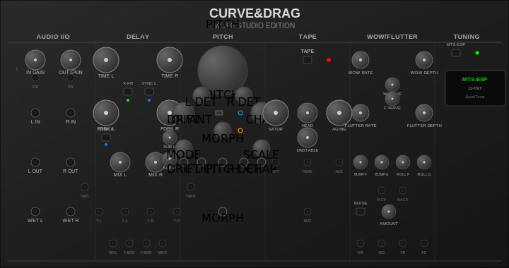

# CurveAndDrag - Professional Stereo Delay & Pitch Shifter

**Version 2.0.0** | A 48HP stereo delay module with vintage tape emulation, advanced pitch shifting, and microtonal support for VCV Rack.

## 🎵 Overview

CurveAndDrag is a professional-grade stereo delay and pitch shifter that combines modern digital precision with vintage analog character. From pristine digital delays to warm tape echoes, from subtle pitch corrections to dramatic time-stretching effects, this module provides comprehensive delay and modulation capabilities with full microtonal support.

## ✨ Key Features

### 🎛️ **Dual Stereo Processing**
- Independent left/right delay lines with individual controls
- Tempo sync with musical subdivisions (1/1 to 1/16, including triplets)
- Cross-feedback routing for complex stereo imaging
- Per-channel detune for stereo width effects

### 📼 **Advanced Vintage Tape Emulation**
- **Neural-inspired time-varying filters** for authentic tape response
- **Multi-resolution wow/flutter** with 6 independent modulation layers
- **Dynamic vintage saturation** with tube-style hysteretic memory
- **Tape aging simulation** with frequency degradation and noise
- **True stereo processing** with realistic L/R decorrelation

### 🎹 **Professional Pitch Shifting**
- **Four vintage algorithms**: BBD (Bucket Brigade), H910 (Harmonizer), Varispeed, and Hybrid modes
- **Per-channel detune** (±50 cents) for chorus and stereo effects
- **Morphing control** between raw and quantized pitch
- **Real-time quantization** with multiple tuning systems

### 🎼 **Microtonal Support**
- **MTS-ESP integration** for real-time microtuning
- **Scala file support** for custom scales and temperaments
- **Built-in scales**: 12-TET, Just Intonation, Pythagorean, 24-TET, 31-TET, Bohlen-Pierce
- **Priority system**: MTS-ESP → Scala → Built-in scales

### 🔧 **Extensive CV Control**
- CV inputs for all major parameters
- Real-time modulation of delay times, feedback, pitch, and tape parameters
- Gate/trigger inputs for tap tempo and buffer reset

## 🚀 Installation

### Prerequisites
- **VCV Rack 2.0+** (Windows/Mac/Linux)
- **Optional**: MTS-ESP compatible tuning software for microtuning
- **Optional**: Scala scale files (.scl format) for custom temperaments

### Installation Steps
1. Download `CurveAndDrag-2.0.0-[platform].vcvplugin` 
2. In VCV Rack: **Library → Import plugin from file**
3. Select the downloaded `.vcvplugin` file
4. Restart VCV Rack
5. Find "CurveAndDrag" in your module browser

## 🎛️ Controls & Usage

### Core Delay Section
- **TIME L/R**: Delay time per channel (1ms-2000ms or tempo divisions)
- **FEEDBACK L/R**: Delay feedback amount (0-95% safe range)
- **MIX L/R**: Dry/wet balance per channel
- **SYNC L/R**: Enable tempo sync per channel
- **SUBDIV L/R**: Subdivision selection when synced

### Pitch & Character Section
- **PITCH**: Main pitch shift (-200 to +200 cents)
- **DETUNE L/R**: Per-channel fine tuning (±50 cents)
- **CHARACTER**: Digital/analog morphing (0% = digital, 100% = analog)
- **QUANTIZE**: Enable pitch quantization
- **MORPH**: Blend between raw and quantized pitch
- **VINTAGE MODE**: Select pitch algorithm (BBD/H910/Varispeed/Hybrid)

### Tape Emulation Section
- **TAPE MODE**: Master tape processing on/off
- **WOW RATE/DEPTH**: Slow pitch modulation (0.1-3 Hz)
- **FLUTTER RATE/DEPTH**: Fast pitch modulation (3-20 Hz)
- **SATURATION**: Vintage tape compression and harmonics
- **TAPE AGE**: Simulate tape wear and frequency degradation
- **TAPE INSTABILITY**: Add organic chaos and coefficient drift

### Master Section
- **TEMPO SYNC**: Master tempo sync enable
- **CROSS FEEDBACK**: Enable L/R cross-feedback
- **INPUT/OUTPUT GAIN**: Signal level controls
- **MTS ENABLE**: Activate MTS-ESP integration
- **SCALE SELECT**: Choose built-in tuning system

## 🎵 Musical Usage Tips

### **Clean Digital Delay**
- TAPE MODE: OFF
- CHARACTER: 0%
- Focus on TIME, FEEDBACK, and MIX controls
- Use tempo sync for rhythmic effects

### **Vintage Tape Echo**
- TAPE MODE: ON
- SATURATION: 50-80% for warmth
- WOW/FLUTTER: 20-40% for character
- TAPE AGE: 20-50% for vintage tone
- CHARACTER: 70-100% for analog feel

### **Pitch Shifting Effects**
- Set VINTAGE MODE (H910 for classic harmonizer sound)
- Use DETUNE L/R for stereo chorus effects
- MORPH between raw and quantized for smooth transitions
- Combine with delay for pitch-shifted echoes

### **Microtonal Exploration**
- Load MTS-ESP software or Scala files
- Enable QUANTIZE for automatic pitch correction
- Use SCALE SELECT for quick temperament changes
- CV control PITCH for real-time microtonal glides

## ⚙️ Technical Specifications

- **Sample Rate**: 44.1kHz - 192kHz
- **Delay Range**: 1ms - 2000ms per channel
- **Pitch Range**: ±200 cents (±2 semitones)
- **CV Range**: ±10V (bipolar), 0-10V (unipolar)
- **Latency**: <5ms processing delay
- **CPU Usage**: Moderate (optimized with lookup tables)

## 🔧 Dependencies & Integration

### MTS-ESP Integration
- Requires MTS-ESP compatible software (Scala, Entonal Studio, etc.)
- Auto-detects MTS master applications
- Real-time tuning table updates
- No additional setup required

### Scala File Support
- Supports standard .scl format
- Load via "Load Scala File" button
- Files can contain cents or ratios
- Automatic error handling and validation

## ⚠️ Known Limitations

### Current Version (2.0.0)
- **Cross-feedback**: Simplified for stability (may be enhanced in future)
- **Tape aging**: Very high values (>80%) may sound extreme
- **High feedback**: Keep below 90% to avoid potential oscillation
- **CPU usage**: Increases with tape mode and complex modulation

### Platform Notes
- **Windows**: Full functionality
- **Mac**: Full functionality (may require security approval)
- **Linux**: Full functionality

## 🐛 Troubleshooting

### No Sound Output
- Check INPUT GAIN and OUTPUT GAIN levels
- Ensure MIX controls are not at 0%
- Verify audio connections

### Tape Mode Issues
- Turn TAPE MODE switch ON for vintage effects
- Start with moderate SATURATION (50%)
- Keep TAPE AGE below 50% initially

### Pitch Shifting Problems
- Check PITCH and DETUNE settings
- Verify VINTAGE MODE selection
- Ensure CHARACTER is properly set

### Microtonal Issues
- Verify MTS-ESP software is running
- Check MTS ENABLE switch
- Confirm Scala files are valid format

## 📞 Support & Development

- **Issues**: Report bugs via GitHub issues
- **Documentation**: Full manual available online
- **Community**: VCV Rack community forums
- **Source**: Open source development

## 📄 License

This module is open source. See LICENSE file for details.

---

*CurveAndDrag v2.0.0 - Professional delay and pitch processing for VCV Rack*
